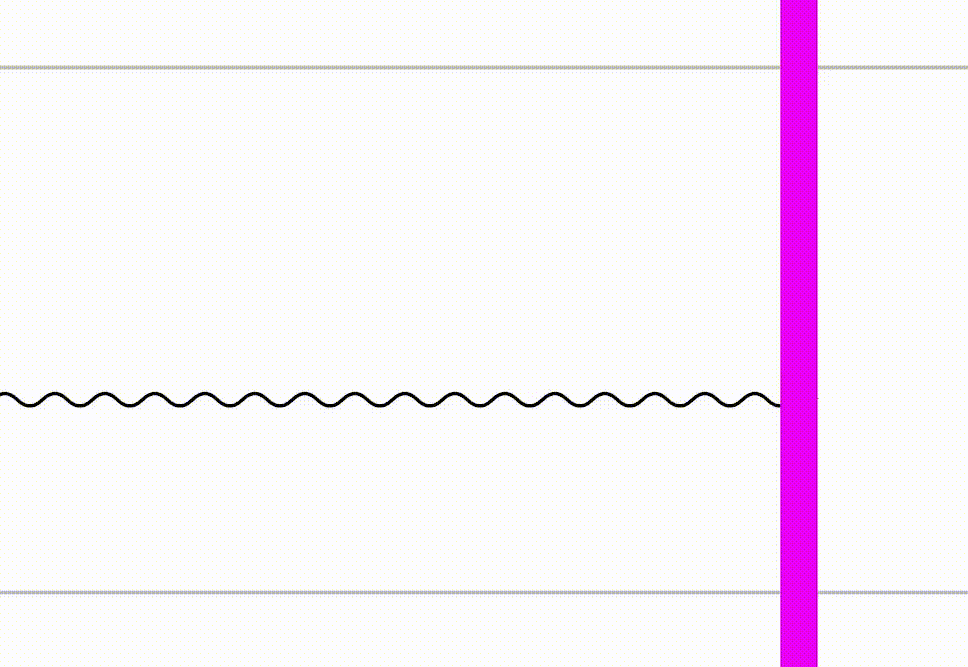

# Jump rope

Reads video input from `/dev/video0` and performs FFT over pixel shade values.
It does this for many 2x2 pixel patches of the video and reaches consensus based
on the most common frequency in the specific band roughly 0.8Hz to 4Hz.

The estimated frequency is then graphed with `x` coordinate being time passing
and `y` being the frequency.
